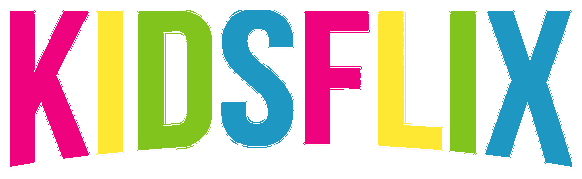

<h1 align="center"></h1> 

Projeto desenvolvido durante a imersão React Alura na semana do dia 27-07 ao dia 31-07, tem como objetivo reproduzir uma interface parecida com a da Netflix. Eu optei por desenvolver algo voltado para as crianças, onde a aplicação irá reunir conteúdos direcionados para o público em questão e separados por idades.     Para isso, usamos o create-react-app myapp (<a href="https://pt-br.reactjs.org/docs/getting-started.html">leia a documentação</a>) para iniciar o projeto, além disso também foram usadas as seguintes bibliotecas:   - <a href="https://reactrouter.com/web/guides/quick-start">React Router Dom </a>   - <a href="https://react-slick.neostack.com/docs/get-started/">React Slick</a>    - <a href="https://styled-components.com/docs/basics#installation">Styled Components</a> 

<footer align="center">Criado durante <a href="https://www.alura.com.br/imersao-react">imersão React Alura</a></footer>